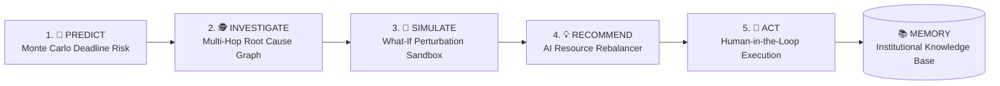

# 🛡️ Project Sentinel: Predictive & Autonomous AI Project Manager

> **"An AI Project Manager that doesn't just manage projects—it predicts project failure, identifies root causes, simulates possible outcomes, and takes corrective actions with human approval."**

[](https://www.python.org/downloads/)
[](https://opensource.org/licenses/MIT)
[](https://streamlit.io/)
[](#)

---

## 🌟 The Core Problem: Why Traditional Project Management Fails

Traditional Project Management tools (Jira, Linear, Asana, Monday) are **purely reactive**:
1. You only find out a milestone is delayed **after the deadline has already passed**.
2. When projects fall behind, humans spend hours manually tracing dependencies across dozens of tickets.
3. Resource overallocation and developer burnout are discovered only after key engineers burn out.
4. "AI features" in current PM tools are merely document generators (writing ticket descriptions or meeting summaries).

---

## 🚀 The Solution: The Sentinel 5-Step Autonomous Decision Loop

Project Sentinel fundamentally transforms project management from **reactive** to **predictive & autonomous**:



---

## 🔥 Key Differentiating Features

### 1. 🔮 Predictive Risk Detection (Monte Carlo Engine)
- Simulates **2,500+ delivery trajectories** factoring in historical sprint velocity variances ($\mu, \sigma$), task completion rates, and critical path blockers.
- Calculates exact probability of failure:
  ```text
  ⚠️ Deadline Risk: HIGH
  Current progress:  58%
  Expected progress: 71%
  Predicted delay:   9 days
  Probability:       84%
  Main cause: Backend API integration is behind schedule.
  ```

### 2. 🕵️ AI Root-Cause Investigator
- Traverses a multi-hop causal graph to drill down from observable symptoms to core structural bottlenecks:
  ```text
  Symptom (5 tasks overdue)
     ↓
  Dependency (3 depend on PAY-103 Webhook Verification)
     ↓
  Bottleneck (PAY-103 stalled on Redis distributed lock)
     ↓
  Resource Overload (Lead Backend Dev operating at 131% capacity)
     ↓
  ROOT CAUSE ISOLATED
  ```

### 3. 🤖 Autonomous Action Agent (Human-in-the-Loop)
- Generates precise, high-leverage corrective interventions.
- Enforces **Human-in-the-Loop (HITL)** approval:
  > *"I recommend reassigning [PAY-105] from Rahul Verma (131%) to Priya Sharma (44%). Approve?"*
- **1-Click Approve & Execute** updates Jira, notifies Slack channels, and adjusts sprint schedules.

### 4. 🧠 What-If / Scenario Simulator
- Interactive sandbox simulating hypothetical perturbations in real time:
  - *What happens if the lead backend developer is unavailable for 5 days?*
    ```text
    Expected delay:     +5.5 days
    Budget impact:      +₹45,000
    Affected tasks:     3 ([PAY-103], [PAY-104], [PAY-105])
    Recommended:        Reassign tasks to Priya Sharma to prevent slippage.
    ```
  - *What if we adjust the target deadline by +3 days?*
  - *What if we drop non-essential scope?*

### 5. 👥 Team Workload & Burnout Optimizer
- Calculates developer utilization percentages and context-switching burnout risk scores.
- Automatically calculates optimal task transfer matrices from overloaded developers to underutilized engineers.

### 6. 📈 Dynamic Project Health Score (0 - 100)
- Multi-dimensional weighted health matrix:
  - **Schedule Health** (25%)
  - **Budget Health** (15%)
  - **Resource Health** (20%)
  - **Dependency Health** (15%)
  - **Risk Health** (15%)
  - **Quality Health** (10%)
- Categorizes status into 🟢 **HEALTHY**, 🟡 **NEEDS ATTENTION**, 🔴 **CRITICAL**.

### 7. 🔗 Dependency Intelligence & Critical Path Method (CPM)
- Evaluates task Directed Acyclic Graphs (DAGs), detects cyclic deadlocks, calculates zero-slack Critical Paths, and models upstream delay cascade risk.

### 8. 📚 Project Institutional Memory
- Preserves long-term memory for Architectural Decision Records (ADRs), previous post-mortems, stakeholder constraints, and lessons learned.
- Includes a natural language Q&A assistant: *"Why did we choose Razorpay over Stripe for payments?"*

---

## 🛠️ System Architecture

```text
RazorPay_agentic_fundmanager/
├── app.py                     # Streamlit Executive Dashboard & Interactive Command Center
├── sentinel/
│   ├── models.py              # Pure Python Dataclass schemas for Tasks, Developers, and Risk
│   ├── dependency_engine.py   # Pure Python DAG, Critical Path Method (CPM), & Cascade Analysis
│   ├── predictive_engine.py   # Monte Carlo Simulation & Velocity Variance Modeling
│   ├── health_engine.py       # Multi-dimensional Project Health Scoring (0-100)
│   ├── root_cause_engine.py   # Multi-Hop Causal Graph Traverser & Bottleneck Isolator
│   ├── scenario_simulator.py  # What-If Perturbation & Impact Simulation Engine
│   ├── resource_optimizer.py  # Workload Analytics & AI Rebalancing Recommendations
│   ├── action_agent.py        # Autonomous HITL Action Engine (Jira/Slack Dispatch)
│   ├── project_memory.py      # Institutional Memory Store & Contextual Q&A Assistant
│   ├── sample_data.py         # Flagship Demo Datasets (Razorpay Payments & E-Commerce)
│   └── orchestrator.py        # Unified 5-Step Loop Orchestrator
├── tests/
│   └── test_sentinel.py       # Comprehensive Unit Test Suite (100% Passing)
├── requirements.txt           # Dependency Manifest
└── README.md                  # Project Documentation & Hackathon Pitch
```

---

## ⚡ Quickstart Guide

### 1. Installation
```bash
git clone https://github.com/ApurvaDabhade/RazorPay_agentic_fundmanager.git
cd RazorPay_agentic_fundmanager
pip install -r requirements.txt
```

### 2. Run Automated Tests
```bash
python3 -m unittest discover tests/
```

### 3. Launch the Interactive Dashboard
```bash
streamlit run app.py
```

---

## 🏆 Hackathon Judges' 2-Minute Demo Script

| Step | Action in Demo UI | What to Say to the Judges |
|:---|:---|:---|
| **1. Overview** | Open **🎯 Executive Dashboard** | *"Notice our Project Health is 68/100 (Needs Attention). Instead of waiting for a project to fail, Sentinel detects risks in advance."* |
| **2. Predict** | Click **🔮 1. Predictive Risk Engine** | *"Our Monte Carlo engine ran 2,500 simulations: 84% probability of missing the deadline with a predicted 9-day delay caused by a backend API bottleneck."* |
| **3. Investigate** | Click **🕵️ 2. Root Cause Investigator** | *"Sentinel traverses the causal graph: 5 overdue tasks $\rightarrow$ depend on PAY-103 $\rightarrow$ lead backend dev Rahul is 131% overloaded."* |
| **4. Simulate** | Click **🧠 4. What-If Scenario Sandbox** | *"Let's test: What if Rahul is out for 5 days? The simulator immediately calculates +5.5 days slippage and ₹45,000 cost impact."* |
| **5. Act** | Click **🤖 3. Autonomous Action Center** | *"Sentinel recommends reassigning PAY-105 to Priya (44% capacity). I click 'Approve & Execute' — the action executes with human-in-the-loop control!"* |

---

## 📄 License
Distributed under the MIT License.
